# Wi-Fi - HTTP/HTTPS OTAF Update

## Table of Contents

- [Wi-Fi - HTTP/HTTPS OTAF Update](#wi-fi---httphttps-otaf-update)
  - [Table of Contents](#table-of-contents)
  - [Purpose/Scope](#purposescope)
  - [Prerequisites/Setup Requirements](#prerequisitessetup-requirements)
    - [Hardware Requirements](#hardware-requirements)
    - [Software Requirements](#software-requirements)
    - [Setup Diagram](#setup-diagram)
  - [Getting Started](#getting-started)
  - [Application Build Environment](#application-build-environment)
  - [Test the Application](#test-the-application)
  - [Additional Information](#additional-information)
    - [Configuring an AWS S3 Bucket](#configuring-an-aws-s3-bucket)
    - [Configuring Azure Blob Storage](#configuring-azure-blob-storage)
    - [Configuring and Uploading Firmware on Apache HTTP](#configuring-and-uploading-firmware-on-apache-http)
    - [Configuring and Uploading Firmware on Apache HTTPs](#configuring-and-uploading-firmware-on-apache-https)

## Purpose/Scope

This application shows how to update the NWP or **M4** firmware of a device via Wi-Fi by downloading an update from **a remote HTTP/HTTPS server**. The server can be run on a local PC (Apache server) or hosted on a cloud service like Amazon AWS or **Microsoft Azure**. The update process goes through the following steps:

- **Connection**: The device connects to a Wi-Fi network and acts as **a HTTP/HTTPS client**.
- **Request**: The device sends a **request** to the HTTP/HTTPS server for the firmware update file.
- **Download**: The server **sends** the firmware file to the device.
- **Update**: The device writes the new firmware to its memory and then **restarts** to complete the update.

This process allows the device to update its software OTA **without needing a physical connection**.

> **Note:** By enabling the `HTTPS_SUPPORT` flag in the `app.c` file, the same HTTP Over-the-Air (OTA) application can be used for HTTPS OTA (NO NEED).

## Prerequisites/Setup Requirements

### Hardware Requirements

- Windows PC
- Wireless Access point
- SiWx91x Wi-Fi Evaluation Kit. The SiWx91x supports multiple operating modes. See [Operating Modes]() for details.
- **SoC Mode**:

  - Standalone
    - BRD4002A Wireless pro kit mainboard [SI-MB4002A]
    - Radio Boards
      - BRD4338A [SiWx917-RB4338A]
      - BRD4343A [SiWx917-RB4343A]
  - Kits
    - SiWx917 Pro Kit [Si917-PK6031A](https://www.silabs.com/development-tools/wireless/wi-fi/siwx917-pro-kit?tab=overview)
    - SiWx917 Pro Kit [Si917-PK6032A]
    - **SiWx917 AC1 Module Explorer Kit (BRD2708A)**
- **NCP Mode**:

  - Standalone
    - BRD4002A Wireless pro kit mainboard [SI-MB4002A]
    - EFR32xG24 Wireless 2.4 GHz +10 dBm Radio Board [xG24-RB4186C](https://www.silabs.com/development-tools/wireless/xg24-rb4186c-efr32xg24-wireless-gecko-radio-board?tab=overview)
    - NCP Expansion Kit with NCP Radio boards
      - (BRD4346A + BRD8045A) [SiWx917-EB4346A]
      - (BRD4357A + BRD8045A) [SiWx917-EB4357A]
  - Kits
    - EFR32xG24 Pro Kit +10 dBm [xG24-PK6009A](https://www.silabs.com/development-tools/wireless/efr32xg24-pro-kit-10-dbm?tab=overview)
  - Interface and Host MCU Supported
    - SPI - EFR32
    - UART - EFR32

### Software Requirements

- Simplicity Studio

### Setup Diagram

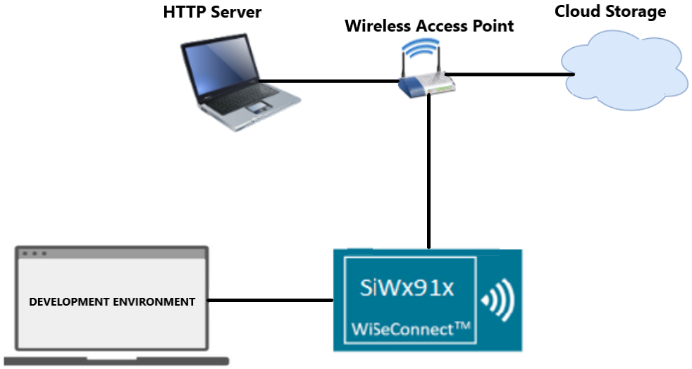

## Getting Started

Refer to the instructions [here](https://docs.silabs.com/wiseconnect/latest/wiseconnect-getting-started/) to:

- [Install Simplicity Studio](https://docs.silabs.com/wiseconnect/latest/wiseconnect-developers-guide-developing-for-silabs-hosts/#install-simplicity-studio)
- [Install WiSeConnect 3 extension](https://docs.silabs.com/wiseconnect/latest/wiseconnect-developers-guide-developing-for-silabs-hosts/#install-the-wi-se-connect-3-extension)
- [Connect your device to the computer](https://docs.silabs.com/wiseconnect/latest/wiseconnect-developers-guide-developing-for-silabs-hosts/#connect-si-wx91x-to-computer)
- [Upgrade your connectivity firmware](https://docs.silabs.com/wiseconnect/latest/wiseconnect-developers-guide-developing-for-silabs-hosts/#update-si-wx91x-connectivity-firmware)
- [Create a Studio project](https://docs.silabs.com/wiseconnect/latest/wiseconnect-developers-guide-developing-for-silabs-hosts/#create-a-project)

For details on the project folder structure, see the [WiSeConnect Examples](https://docs.silabs.com/wiseconnect/latest/wiseconnect-examples/#example-folder-structure) page.

## Application Build Environment

The application can be configured to suit your requirements and the development environment. Read through the following sections and make any changes needed.

- The application uses the default configurations as provided in the **DEFAULT_WIFI_CLIENT_PROFILE** in **sl_net_default_values.h** and you can choose to configure these parameters as needed.
- In the Project explorer pane, expand the **config** folder and open the ``sl_net_default_values.h`` file. Configure the following parameters to enable SiWx91x to connect to your Wi-Fi network.

  - STA instance related parameters:

    - DEFAULT_WIFI_CLIENT_PROFILE_SSID refers to **the name with which the Wi-Fi** network will be advertised and Si91X module is connected to it.

      ```c
      #define DEFAULT_WIFI_CLIENT_PROFILE_SSID               "YOUR_AP_SSID"  
      ```
    - DEFAULT_WIFI_CLIENT_CREDENTIAL refers to **the secret key** if the access point is configured in WPA-PSK/WPA2-PSK security modes.

      ```c
      #define DEFAULT_WIFI_CLIENT_CREDENTIAL                 "YOUR_AP_PASSPHRASE" 
      ```
    - Other STA instance configurations can be modified if required in **DEFAULT_WIFI_CLIENT_PROFILE** configuration structure.
- The following configurations in the ``app.c`` file can be configured as per requirements:

  - Select HTTPS CERTIFICATE INDEX

    - For HTTPS Certificate index select, the default value of the CERTIFICATE_INDEX is set to '0'. To set SL_SI91X_HTTPS_CERTIFICATE_INDEX_1, modify the CERTIFICATE_INDEX to '1' and to set SL_SI91X_HTTPS_CERTIFICATE_INDEX_2, modify the CERTIFICATE_INDEX to '2'.

      ```c
      //! set 1 for selecting SL_SI91X_HTTPS_CERTIFICATE_INDEX_1, set 2 for selecting SL_SI91X_HTTPS_CERTIFICATE_INDEX_2
      #define CERTIFICATE_INDEX 0
      ```
  - - Based on the type of server (**Apache**/AWS S3 bucket/**Azure Blob Storage**) from which the firmware files need to be downloaded, the following parameters need to be configured.

      - Configure FLAGS to choose the version and security type to be enabled.

        Valid configurations are:

        ```c
        #define HTTPS_SUPPORT    BIT(0)         // Set HTTPS_SUPPORT to use HTTPS feature
        #define HTTPV6           BIT(3)         // Enable IPv6. Set this bit in FLAGS. Default is IPv4
        #define HTTP_V_1_1       BIT(6)         // Set HTTP_V_1_1 to use HTTP version 1.1
        ```
      - In the application, the **AWS_ENABLE** macro is enabled by default. Depending on the requirement, the user can enable downloading firmware from Azure Blob storage (Enable Macro **AZURE_ENABLE**).
      - Else, if both **AWS_ENABLE** and **AZURE_ENABLE** macros are disabled, HTTP/HTTPS Apache server can be used to download the firmware.
      - In the application, the following parameters should be configured:

        - HTTP_PORT refers to HTTP Server port number.
        - HTTP_SERVER_IP_ADDRESS refers to HTTP Server IP address.
        - HTTP_URL refers to HTTP resource name.
        - HTTP_HOSTNAME refers to HTTP server hostname.
        - HTTP_EXTENDED_HEADER refers to HTTP extended header. If NULL, the default extented header is filled.

          The purpose of this macro is to append user configurable header fields to the default HTTP/HTTPS header.
          The extended header may contain multiple header fields, with each field terminated by "\r\n" (0x0D 0x0A).

          Example: **key1:value1"\r\n"key2:value2"\r\n"**
        - USERNAME refers to the username to be used to access the HTTP resource.
        - PASSWORD refers to the password to be used to access the HTTP resource.

## Test the Application

Refer to the instructions [here](https://docs.silabs.com/wiseconnect/latest/wiseconnect-getting-started/) to:

1. Build the application.
2. Flash, run, and debug the application.

   - 
   - Application prints with Azure Blob Storage

     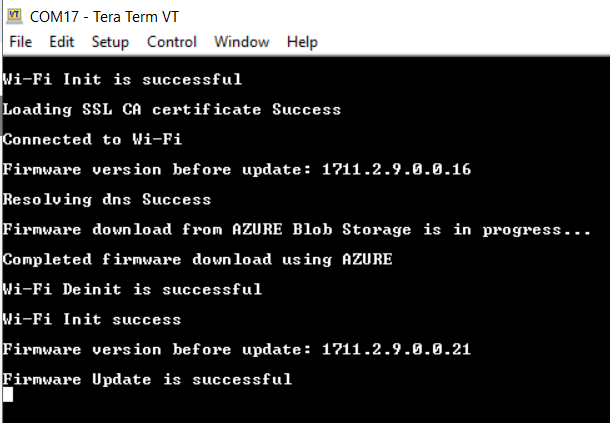
   - 

## Additional Information

### Configuring Azure Blob Storage

1. Login to your Azure account and go to **Storage Account** or search for **Storage Account**.

   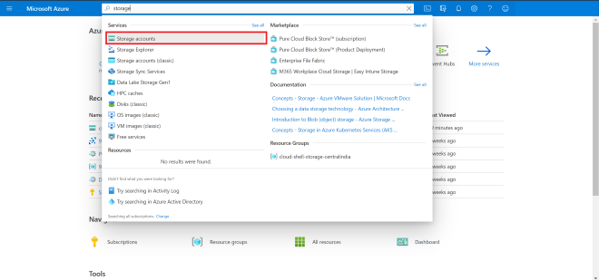
2. Open storage account and create a new storage.

   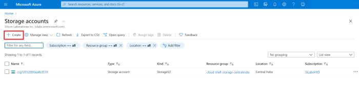
3. While creating a storage account, select your **common Resource Group** you have already created and provide a storage account name.
4. Select preferred location. For the account kind, select **Blob-Storage** and Replication select **LRS**.

   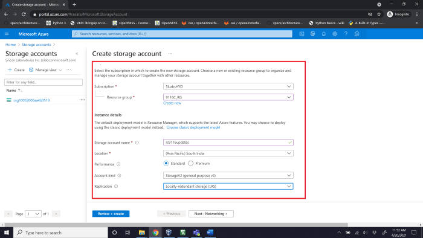
5. Review and create your storage account.
6. Now download the Windows Storage Explorer here.
7. After installing the storage explorer, open **Azure Storage Explorer** in your Windows machine and navigate to Account management and add your Azure account.

   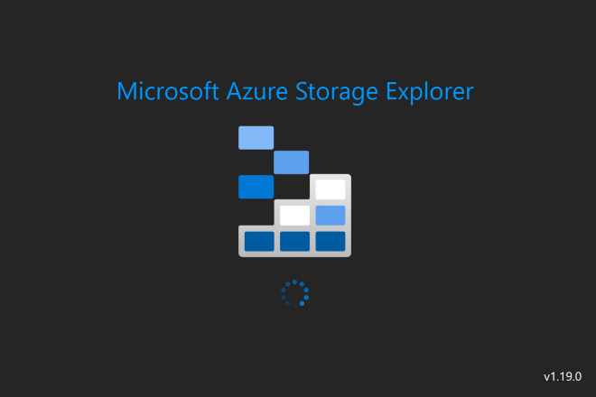

   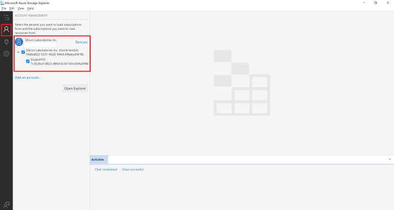
8. Click on the **Open connect** dialog, where you need to select a resource from the list as shown below.

   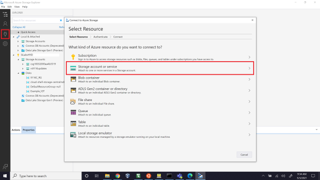
9. Select Storage account or service, then select connection method as **Connection String**.

   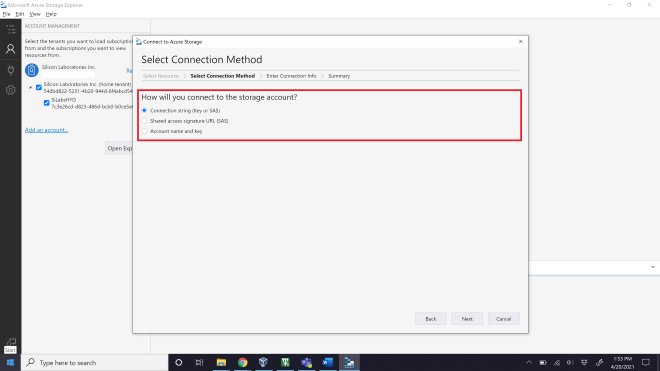
10. In the Azure Portal, navigate to your newly created storage account and select **Access Keys**. Copy the connection string for Key1.

    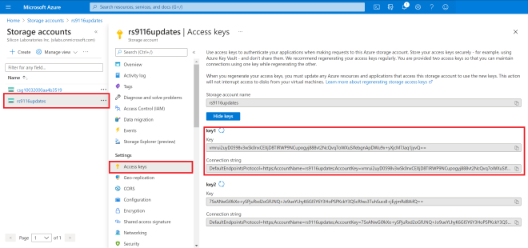
11. The connection string has to be given in the local Azure Storage Explorer app.
12. Upon successfully adding, you should now see the EXPLORER tab on your Azure Storage Explorer displaying all the storages available in your account.

    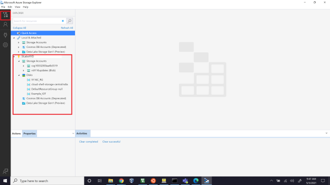
13. In the Azure Portal, search for **Storage Explorer** and perform the same steps as above. However, this option is in preview, so it is better to use **Windows Azure Storage Explorer**.
14. Create a new blob container as shown below:

    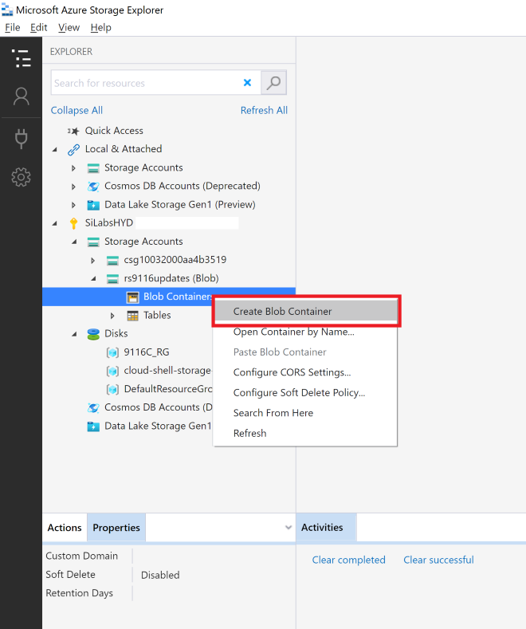
15. The route folder name you provide is quite important as all the further connections happen from here. For this example, we chose a file extension. The name used here is “**rps**”.
16. This should create a new folder, which looks like this:

    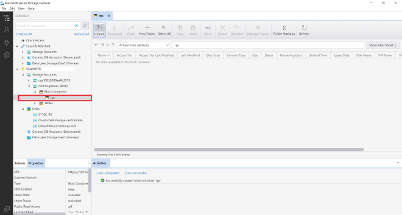
17. Change the Public Access Level by right-clicking on the new folder and selecting **Set Container Access Level**.

    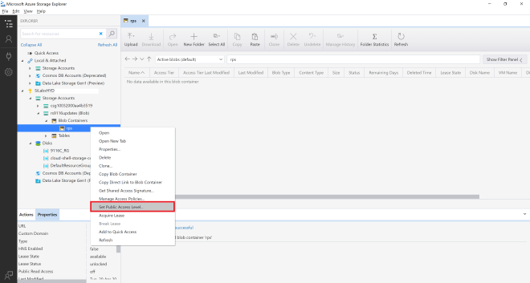
18. We can upload the **Device Update File**:

    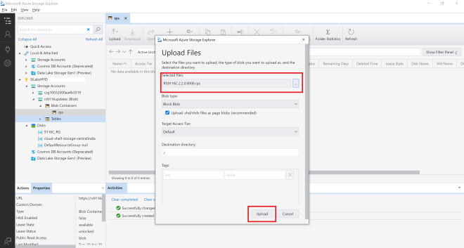
19. Once done uploading, we can see the file:

    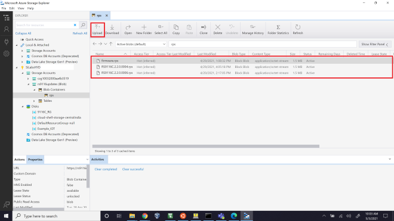
20. Right-click on the uploaded file, then select properties. You will find a URL path.

    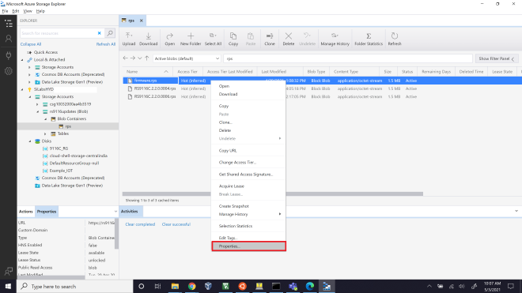
21. Copy the URL path as this link is **used for accessing our device update files**.

    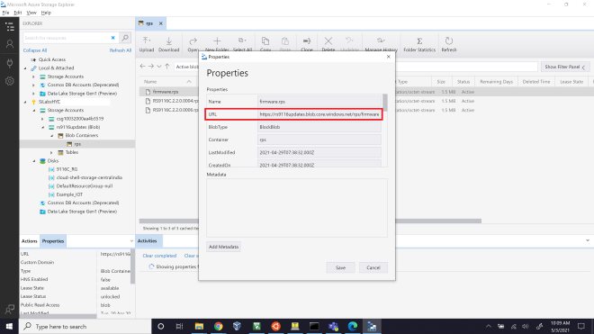
22. By accessing this URL, you can download the **Device Update** files in the application.
